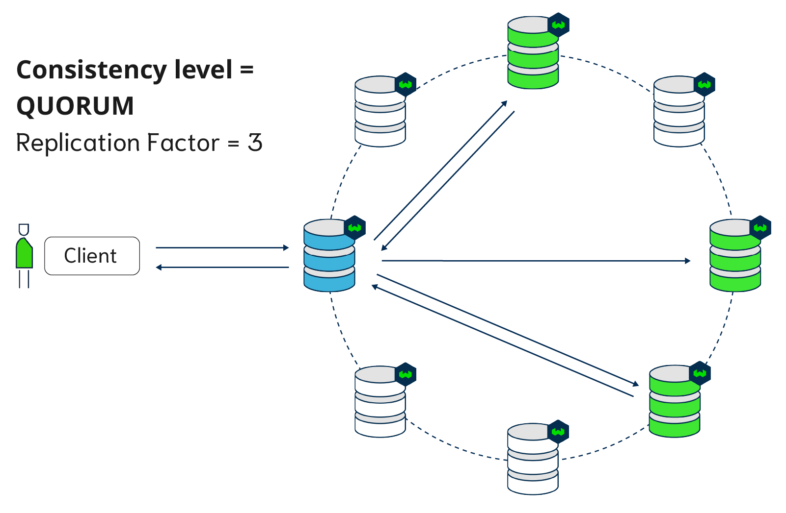
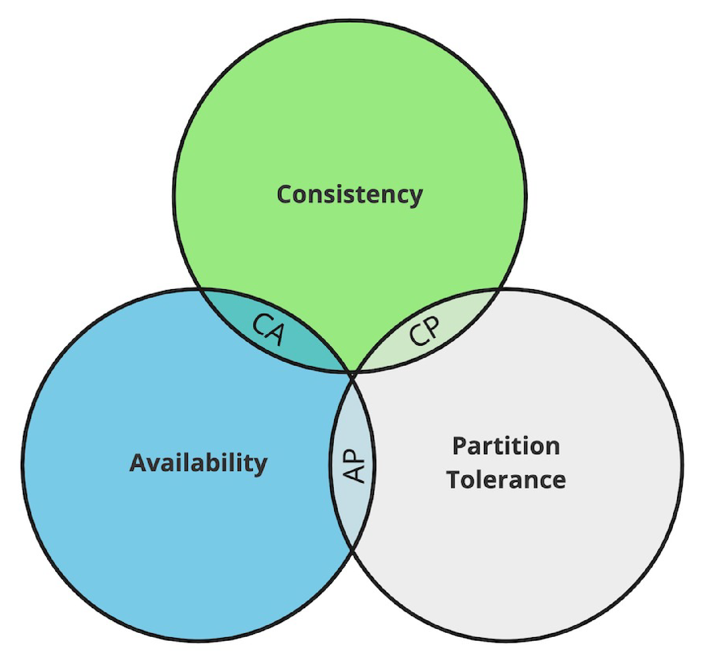

import Badges from '/_includes/badges.mdx';

<Badges/>

Weaviate's v1.17 release introduces replication. Using Weaviate in a cluster with multiple server nodes, Weaviate can now automatically replicate data across nodes in the background. This enables a variety of [Use cases](./replication-architecture/motivation.html). For example, if a node goes down, another node can shoulder the load without loss of availability or data. Database replication improves reliability, scalability, and/or performance. The user can control trade-offs between consistency and availability through [tunable consistency](./replication-architecture/consistency.html). Weaviate has a leaderless replication design, so there is no distinction between primary and secondary nodes thereby removing all single points of failures.

In this Replication Architecture series, you will find information about:

* **General Concepts**, on this page
  * What is replication
  * CAP Theorem
  * Why replication for Weaviate?
  * Replication vs Sharding
  * How does replication work in Weaviate?
  * Roadmap

* **[Use Cases](./replication-architecture/motivation.html)**
  * Motivation
  * High Availability
  * Increased (Read) Throughput
  * Zero Downtime Upgrades
  * Regional Proximity

* **[Philosophy](./replication-architecture/philosophy.html)**
  * Typical Weaviate use cases
  * Reasons for a leaderless architecture
  * Gradual rollout
  * Large-scale testing

* **[Cluster Architecture](./replication-architecture/cluster-architecture.html)**
  * Leaderless design
  * Replication Factor
  * Write and Read operations

* **[Consistency](./replication-architecture/consistency.html)**
  * Schema
  * Data objects
  * Repairs

* **[Multi-DataCenter](./replication-architecture/multi-dc.html)**
  * Regional Proximity

{:style="max-width: 75%; display: block; margin: 0 auto"}

## What is replication?

Database replication occurs when you keep a copy of the same datapoint on multiple nodes of a cluster, which in-turn creates a distributed database. A distributed database consists of multiple nodes, all of which can contain a copy of the data. So if one node (server) goes down, users can still access data from another node. In addition, query throughput can be improved with replication. In short, a distributed database is more reliable and can achieve higher performance than a centralized system.

## CAP Theorem

The primary goal of introducing replication is to improve reliability. [Eric Brewer](https://en.wikipedia.org/wiki/Eric_Brewer_(scientist)) states that there are some limits on reliability for distributed databases, described by the CAP theorem. The [CAP theorem](https://en.wikipedia.org/wiki/CAP_theorem) states that a distributed database can only provide two of the following three guarantees: 
* **Consistency (C)** - Every database read receives the most recent write after creation or modification (or an error).
* **Availability (A)** - Every request receives a non-error response all the time, without the guarantee that it contains the most recent write. 
* **Partition tolerance (P)** - The system continues to operate despite an arbitrary number of messages being dropped (or delayed) by the network between nodes.

{:style="max-width: 60%; display: block; margin: 0 auto"}

Ideally you want a database, like Weaviate, to have the highest reliability as possible, but this is limited by the tradeoff between consistency, availability and partition tolerance. Only two out of three concepts can be guaranteed. Since we're talking about distributed systems in which network partitions are present, only two options are left for designing the system: **consistency (C)** or **availability (A)**. When you prioritize **consistency** over availability, the database will return an error or timeout when it cannot be guaranteed that the data is up to date due to network partitioning. When prioritizing **availability** over consistency, the database will always process the query and try to return the most recent version of data even if it cannot guarantee it is up to date due to network partitioning. 

C over A is preferred when the database contains critical data, such as transactional bank account data. For transactional data, you want the data to always be consistent (otherwise your bank balance is not guaranteed to be correct if you make transactions while some nodes (e.g. atms) are down). 
When a database involves less critical data, A over C can be preferred. An example can be a messaging service, where you can tolerate showing some old data but the application should be highly available and handle large amounts of writes with minimal latency. Weaviate follows this latter design, since Weaviate typically deals with less critical data and  is used for approximate search as a secondary database in use cases with more critical data. More about this design decision in [Philosophy](./replication-architecture/philosophy.html).

## Why replication for Weaviate?

Weaviate is a database, and users want to reliably receive answers to their requests made to the database. As discussed above, database reliability consists of various parts. Use cases in which replication for Weaviate is desired are the following. For detailed information about those use cases, visit the [Replication Use Cases (Motivation) page](./replication-architecture/motivation.html).

1. **High availability (redundancy)** \
  With a distributed (replicated) database structure, service will not be interrupted if one server node goes down. Read queries can still be available, the users' queries will be (unnoticeably) redirected to an available node. 
2. **Increased (read) throughput** \
  Adding extra server nodes to your database setup means that the throughput scales with it. The more server nodes, the more users (read operations) the system will be able to handle. When reading is set to a low consistency level, then scaling the replication factor (i.e. how many database server nodes) increases the throughput linearly.  
3. **Zero downtime upgrades** \
  Without replication, there is a window of downtime when you update a Weaviate instance. This is because the single node needs to stop, update and restart before it's ready to serve again. With replication, upgrades are done using a rolling update, in which at most one node is unavailable at any point in time while the other nodes can still serve traffic. 
4. **Regional proximity** \
  When users are located in different regional areas (e.g. Iceland and Australia as extreme examples), you cannot ensure low latency for all users due to the physical distance between the database server and the users. With a distributed database, you can place nodes in different local regions to decrease this latency. This depends on the Multi-Datacenter feature of replication. 

## Replication vs Sharding
Replication is not the same as sharding. [Sharding (horizontal scaling) was introduced to Weaviate in v1.8](../architecture/cluster.html).

* **Replication** copies the data to different server nodes. For Weaviate, this helps data availability and provides redundancy in case a single node fails. Query throughput can be improved with replication. 
* **Sharding** handles horizontal scaling across servers by dividing the data and sending the pieces of data (shards) to multiple replica sets. The data is thus divided, and all shards together form the entire set of data. You can use sharding with Weaviate to run larger datasets and speed up imports. 
  
{:style="max-width: 60%; display: block; margin: 0 auto"}

Replication and sharding can be combined in a setup, to improve throughput and availability as well as import speed and support for large datasets. For example, you can have 3 replicas of the database and shards set to 3, which means you have 9 shards in total, where each server node holds 3 different shards. 

## How does replication work in Weaviate?
Weaviate’s implementation of replication is inspired by other databases like Cassandra. Availability is favored over Consistency. Weaviate's replication has a leaderless design, which means there are no primary and secondary nodes. When writing and reading data, the client contacts one or more nodes. A load balancer exists between the user and the nodes, so the user doesn't know which node they are talking to (Weaviate will forward internally if a user is requesting a wrong node). 

Weaviate’s data schema changes are strongly consistent, since this is rarely changed, but critical. Schema changes will happen with a distributed transaction with a two-phase commit. This is 'slow', but consistent because it disallows conflicting schema changes at the same time.

The number of nodes that need to acknowledge the read or write (from v1.18) operation is tunable, to ONE, QUORUM (n/2+1) or ALL. When write operations are configured to ALL, the database works synchronously. If write is not set to ALL (possible from v1.18), writing data is asynchronous from the user's perspective. 

The number of replicas doesn't have to match the number of nodes (cluster size). It is possible to split data in Weaviate based on Classes. Note that this is [different from Sharding](#replication-vs-sharding). 

Read more about how replication works in Weaviate in [Philosophy](./replication-architecture/philosophy.html), [Cluster Architecture](./replication-architecture/cluster-architecture.html) and [Consistency](./replication-architecture/consistency.html).

## How do I enable replication in Weaviate?

Read the [Replication Usage page here](../configuration/replication.html). You can enable replication on class-level in the data schema of your Weaviate instance. During querying, you can specify the consistency level.

## Roadmap

* v1.17 (12/2022)
  * Leaderless Replication
  * Tunable Read Consistency for Get-by-ID requests
* v1.18 (02/2022)
  * Tunable Write Consistency
  * Tunable Read Consistency for all requests
  * Repairs (Read-Repairs or Background/Async Repairs)
* Not scheduled yet 
  * Multi-Datacenter replication (you can upvote this feature [here](https://github.com/semi-technologies/weaviate/issues/2436))

## More Resources

import DocsMoreResources from '/_includes/more-resources-docs.md';

<DocsMoreResources />
